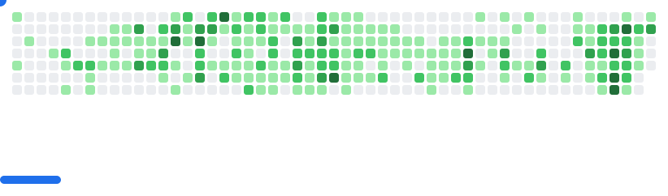

# Hi! I'm Giovanni 👋

<picture>
  <source
    media="(prefers-color-scheme: dark)"
    srcset="images/breakout-dark.svg"
  />
  <source
    media="(prefers-color-scheme: light)"
    srcset="images/breakout-light.svg"
  />
  
</picture>

## 🚀 About Me
- 🎓 Currently studying **Artificial Intelligence Systems**, University of Trento
- ✨ **NLP** enthusiast
- 🗺️ **OpenStreetMap** Foundation member

